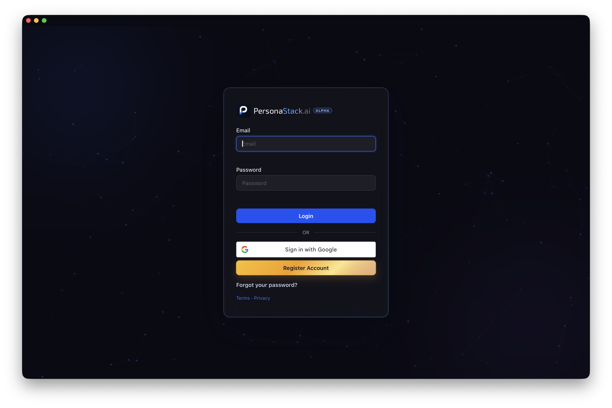

<div align="center">

<h1>PersonaStack for macOS</h1>

<p>Your PersonaStack workspace in a native Mac app.</p>



</div>

## Install

Requires macOS 14 or later.

```sh
brew install --cask personastack/tap/personastack
```

Open PersonaStack from Applications and sign in.

## Updates

PersonaStack can check for updates from the menu-bar dropdown or the **PersonaStack** menu. Package updates require administrator approval.

To update through Homebrew:

```sh
brew update
brew upgrade --cask --greedy personastack/tap/personastack
```

Every new macOS app release updates this tap's cask version and checksum. The macOS release workflow publishes the same installer bytes to the versioned tap download and GitHub Release. It also updates the signed Sparkle feed.

This tap also provides [PersonaStack Connector](Formula/personastack-connector.rb), a separate command-line tool for locally hosted persona runtimes.
